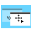

# `winctrl`

GNOME like mouse-centric window management on Windows.

<div align="center">
  
</div>

## 🌟 Features

  - **Move Windows**: Hold down the <kbd>Win</kbd> key and drag a window with the `Left Mouse Button` (hold and drag) to move it. You don't have to target the titlebar!
  - **Maximize on Top**: Dragging a window to the very top edge of the screen will maximize it.
- **Maximize/Restore Window**: Hold down the <kbd>Win</kbd> key and *tap* the `Left Mouse Button` to toggle between maximized and restored states for the window under the cursor.
- **Resize Windows**: Hold down the <kbd>Win</kbd> key and drag with the `Middle Mouse Button`. Resizing is directional based on where you click:
  - **Edges**: Dragging from a window's side or top/bottom edge resizes along that axis.
  - **Corners**: Dragging from a corner resizes both height and width.
  - **Center**: Dragging from the center "zooms" the window in and out, preserving its aspect ratio.
- **Adjust Transparency**: Hold <kbd>Win</kbd> + <kbd>Ctrl</kbd> and use the `Mouse Scroll Wheel` to adjust the transparency of the window under the cursor.
- **Virtual Desktop Switch**: Hold down the <kbd>Win</kbd> key and use the `Mouse Scroll Wheel` to switch between virtual desktops.

## 📖 Usage

After building, you can run the application from the terminal

```
. .\winctrl.exe
```

> [!TIP]
>
> To have `winctrl.exe` run automatically every time you log in, you can add a shortcut to it in your Windows Startup folder:
> 1. Press <kbd>Win</kbd> + <kbd>R</kbd> to open the Run dialog.
> 2. Type `shell:startup` and press <kbd>Enter</kbd>. This will open the Startup folder.
> 3. Create a shortcut to your `winctrl.exe` file and place it in this folder.
> Now Windows will launch the program on startup!

---

## License

The project is licensed under the [MIT License](./LICENSE)
